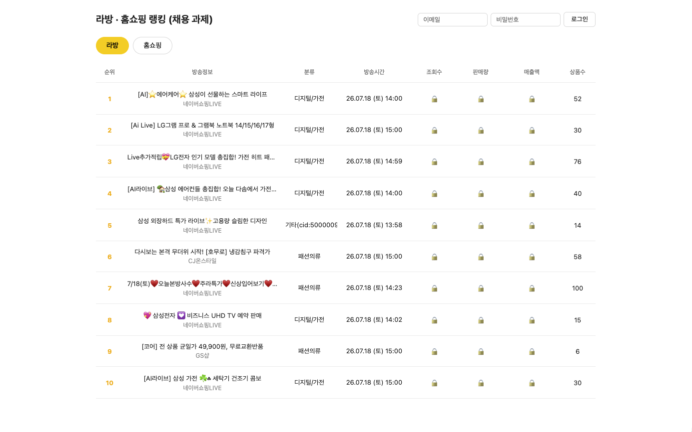
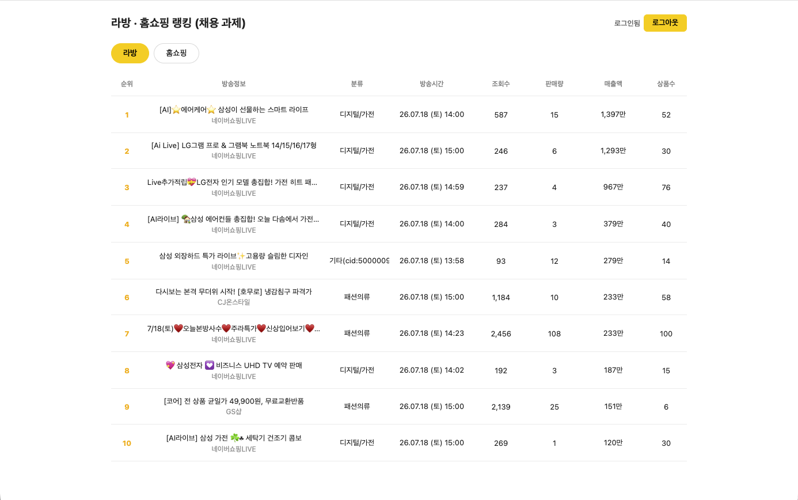
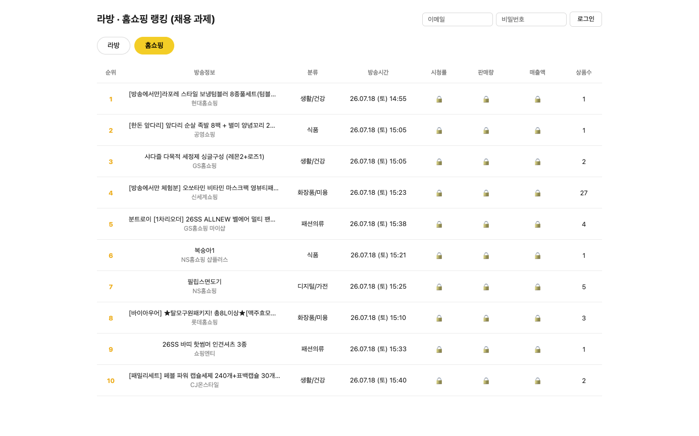
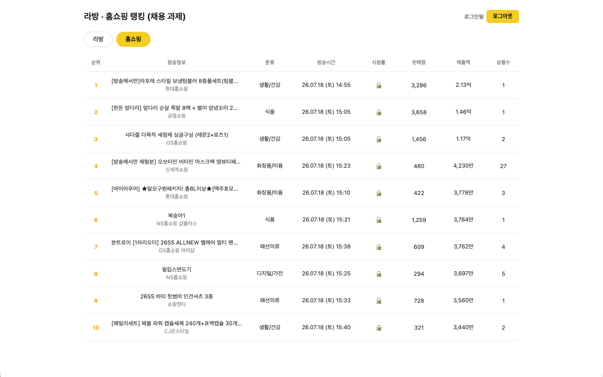

# 라방바 데이터랩 - 채용 과제

라방바 데이터랩(live.ecomm-data.com)의 라방, 홈쇼핑 실시간 랭킹 TOP10을 보여주는 웹 페이지입니다.

## 구현 범위

- 라방 / 홈쇼핑 탭 토글로 목록 전환 (탭 상태는 URL 쿼리 파라미터로 유지, 새로고침 시에도 복원)
- 탭별 실시간 TOP10을 테이블로 표시 (순위 · 방송정보 · 분류 · 방송시간 · 조회수/시청률 · 판매량 · 매출액 · 상품수)
- 비로그인 상태: 제목·채널·분류·방송시간·상품수를 실시간으로 표시, 조회수·판매량·매출액은 🔒
- 로그인 상태: 라방바 계정으로 직접 로그인하면 모든 필드가 실시간으로 표시

## 실행 방법

터미널 두 개가 필요합니다.

**백엔드 (server/)**

```bash
cd server
npm install
npm run dev   # http://localhost:4000
```

**프론트엔드 (client/)**

```bash
cd client
npm install
npm run dev   # http://localhost:5173
```

## 테스트 실행

`formatRevenue`, `formatDateTime`, `parseLbDatetime` 등 순수 함수에 대한 단위 테스트입니다.

```bash
cd client && npm run test   # 2개 파일, 11개 테스트
cd server && npm run test   # 1개 파일, 6개 테스트
```

## 로그인

우측 상단의 이메일/비밀번호 입력 폼에 라방바 계정 정보를 직접 입력합니다. 테스트용 계정 정보는 이메일 제출 시 함께 전달드렸습니다.

- 로그인 성공 시 서버가 세션을 관리하고, 새로고침 후에도 로그인 상태가 유지됩니다.
- 서버 재시작 시 세션이 초기화되므로 다시 로그인이 필요합니다 (의도된 동작).

## 화면

**라방 탭**

| 비로그인 | 로그인 |
|---|---|
|  |  |

**홈쇼핑 탭**

| 비로그인 | 로그인 |
|---|---|
|  |  |

## 아키텍처

### client / server 분리 이유

1. **CORS 우회**: `live.ecomm-data.com` API를 브라우저에서 직접 호출하면 CORS 오류가 발생합니다. 서버가 대신 호출하고 결과를 프론트에 전달합니다.
2. **세션 보안**: 라방바 로그인 후 발급되는 httpOnly 쿠키는 브라우저 JS로 읽을 수 없습니다. 서버가 이 쿠키를 인메모리 Map에 보관하고, 클라이언트에는 자체 세션 ID만 내려줍니다.
3. **관심사 분리**: 외부 API 호출·필드 변환은 서버, 렌더링·상태 관리는 클라이언트가 담당합니다.

### 데이터 흐름

**비로그인**
```
클라이언트 → GET /api/broadcasts?type=lb
  → 서버: 라방바 API 호출 (세션 없이)
  → 응답: 제목, 채널, 분류, 방송시간, 상품수만, 조회수/판매량/매출액은 null
  → 클라이언트: null 필드는 🔒 표시
```

**로그인 흐름**
```
사용자 email/password 입력 → POST /api/login
  → 서버: 라방바 로그인 API에 전달 → sales2 세션 쿠키 수신
  → 서버: 인메모리 Map에 { our_session_id: sales2_cookie } 저장
  → 클라이언트: our_session 쿠키 수신 (httpOnly)

로그인 후 GET /api/broadcasts?type=lb
  → 서버: Map에서 sales2 쿠키 조회 → 라방바 API에 첨부하여 호출
  → 응답: 조회수/판매량/매출액 포함한 전체 데이터
  → 클라이언트: 모든 필드 실시간 표시
```

## 트러블슈팅

**CORS 문제**
브라우저에서 `live.ecomm-data.com` API를 직접 호출하면 CORS 정책에 막힙니다.
→ Express 백엔드를 프록시로 두어 서버에서 외부 API를 호출하고 결과만 클라이언트에 전달하는 방식으로 우회했습니다.

**카테고리(cid) 일부가 "기타"로 표시되는 문제**
API 응답 필드, 별도 카테고리 엔드포인트, JS 번들, Next.js `__NEXT_DATA__`까지 확인했으나 카테고리 이름이 클라이언트에 전달되지 않는 것으로 확인됐습니다. 라방바 서버 내부에서만 처리되는 정보로, 외부 API 설계상 접근 불가능한 제약입니다.
→ 확인된 cid는 매핑 테이블에 직접 등록하고, 미등록 cid는 `기타(cid:숫자)` 형태로 fallback해 정보 손실 없이 처리합니다.

**로그인 상태가 새로고침 시 초기화되는 문제**
httpOnly 세션 쿠키는 브라우저 JS에서 직접 읽을 수 없어 `localStorage` 등으로 로그인 상태를 유지할 수 없습니다.
→ 페이지 로드 시 `/api/me` 엔드포인트를 호출해 서버가 세션 유효성을 확인하고 로그인 상태를 복원하는 방식으로 해결했습니다.

## 폴더 구조

```
cv3-assignment/
├── docs/                          # README 이미지 리소스
├── client/                        # React + TypeScript (Vite)
│   ├── index.html                 # Vite HTML 진입점, main.tsx를 스크립트로 로드
│   ├── tsconfig.json
│   ├── package.json
│   └── src/
│       ├── main.tsx               # React 앱 진입점, <App />을 DOM에 마운트
│       ├── App.tsx                # 탭·로그인 상태 관리, 데이터 fetch, 로그인 폼 UI
│       ├── BroadcastTable.tsx     # TOP10 테이블 렌더링 (비로그인 잠긴 값은 🔒 표시)
│       ├── types.ts               # Broadcast 공통 타입 정의 (client 전역)
│       ├── formatDateTime.ts      # ISO 문자열 → "26.07.17 (금) 14:00" 변환 유틸
│       ├── formatRevenue.ts       # 원단위 숫자 → 조/억/만 단위 한국어 표기 변환 유틸
│       ├── formatRevenue.test.ts  # formatRevenue 단위 테스트 (vitest)
│       ├── formatDateTime.test.ts # formatDateTime 단위 테스트 (vitest)
│       └── index.css              # 전역 스타일 (테이블·폼·레이아웃)
│
└── server/                        # Node + Express + TypeScript
    ├── tsconfig.json
    ├── package.json
    └── src/
        ├── index.ts               # Express 앱 설정, 라우트 정의
        │                          #   POST /api/login · POST /api/logout
        │                          #   GET  /api/me   · GET  /api/broadcasts
        ├── authService.ts         # 라방바 로그인 API 중계, Set-Cookie 파싱
        ├── session.ts             # 인메모리 세션 스토어 (Map<sessionId, labangbaCookie>)
        ├── broadcastService.ts    # 외부 API 호출, CID 매핑, 필드 변환, TOP10 추출
        ├── broadcastService.test.ts # parseDatetime 단위 테스트 (vitest)
        └── types.ts               # 서버 내부 타입 정의 (LbItem, HsItem 등)
```
